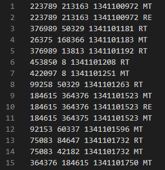
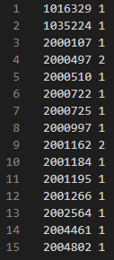
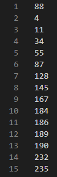
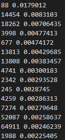
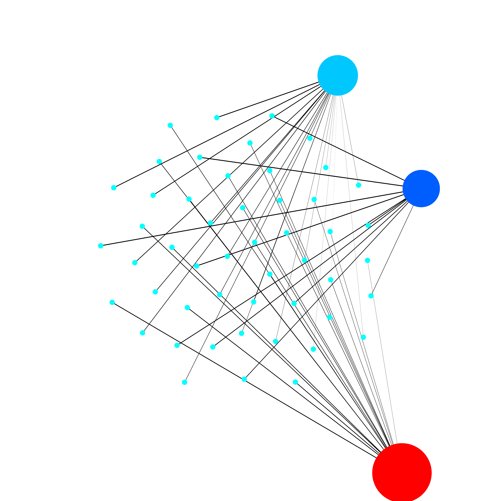

## CS 225 Final Project Results

For our final project, we wanted to find the most influential Twitter users who helped spread the news of the discovery of the Higgs Boson particle. We used the Higgs Twitter Dataset, which contains a series of graphs detailing interactions between users.

In order to organize the datasets better, we decided to use a matrix in the form of a map to keep track of (directed) interactions between users. One of the provided dataset files is higgs-activity_time.txt. In this file, each line holds the ID of the first user, the ID of the second user, a timestamp for the interaction, and the type of interaction. The interactions can be retweets (RT), mentions (MT), or replies (RE). With out implementation, we decided to ignore timestamps, as they aren’t important for determining the number of interactions, and replies, as each reply had a matching mention, so including replies would double the amount of interactions.

To translate this into a matrix, we interpreted mentions and retweets as having the second user being the “parent” of the interaction. Then, we calculated an index using the following formula: (user2id) * 500,000 + user1id. 500,000 is used here because it is larger than the largest user ID, which is around 450,000. We then checked the map to see if the key with the index existed. If it did, we incremented the number of interactions (the value for that key) by one. If not, we created the key using the index and set its number of interactions as one. We then stored our completed map into data/matrix_data.txt to skip having to rerun the matrix constructing algorithm.

Our next task was to implement a DFS traversal for our dataset. Since we had our data in matrix form, we decided to use DFS on the matrix. To begin, we picked a random user ID to start the traversal from. The user was marked as visited (using another map), and we added users connected to the current user by traversing across the "row of the matrix". The same steps would happen for each new user, until the entire matrix is traversed. Each user id is pushed onto a vector during the traversal, and at the end, the vector is returned to give the traversal.

Afterwards, we implemented a PageRank algorithm for our dataset, so we could see which users were the most important for spreading the news. We implemented an [iterative PageRank algorithm](https://cs50.harvard.edu/extension/ai/2020/spring/projects/2/pagerank/) rather than using a Markov Chain since the size of the matrix needed too large. However, as traditional PageRank gives more weight towards nodes with lots of incoming arcs, we wanted to find a way to alter the algorithm so that it would give more weight for nodes with lots of outgoing arcs. To achieve this, we read data/higgs-activity_time.txt to get each user interaction. Then, we create a set that stores pairs of user IDs. Instead of setting the pairs as (user2id, user1id), we flip them as (user1id, user2id). By doing this, we treat outgoing edges as "incoming", giving us essentially what we want with the traditional PageRank algorithm. 

The values in the set are then transferred to a map and the map is used to create a flipped version of the matrix. These two matrices are then used to generate the PageRank values for each user, and the function returns a vector of pairs of ints (user ids) and doubles (weights).

Lastly, with the PageRank data, we constructed a force-directed graph visualization. We based our code off of [Brad Smith's algorithm](https://www.brad-smith.info/blog/archives/129), which was written in C#. We grab the top few users, ranked using the PageRank algorithm, and give them random positions on the diagram. Then, we add the first 20 connections for each node, with preference towards nodes already connected to other nodes. Then, we use Hooke's Law and Coulomb's Law to generate attractive/repulsive forces, and update the the positions of the nodes for many iterations, or until the total displacement of the nodes hits a specified minimum value. Once the iterations are over, the edges are drawn, then the nodes. All of the children nodes are drawn with an aqua color and have a fixed radius. All of the parent nodes' radii and colors are based on their respective node's weight, with red being the largest and dark blue being the smallest. The PNG is then saved to diagram.png.

A discovery that we made was that user 88 was the most influential in spreading the news of the discovery. Additionally, the third ranked user for PageRank (18,262) only has two children, but since one of the children is the second ranked user (14,454), the PageRank algorithm also gives the third ranked user a large value. From checking the rest of the PageRank users, we saw that 4/5ths of the users had the same, lowest PageRank value (4.92302e-07). This means that only 1/5th of the users were involved more than once in spreading the news of the discovery. Lastly, we tried looking for user 88 using Twitter's advanced search. Since Twitter doesn't account for mentions, we only found two potential candidates, Colin Eberhardt or Neil deGrasse Tyson. We suspect one of these two may be user 88, but there is no definitive proof.
